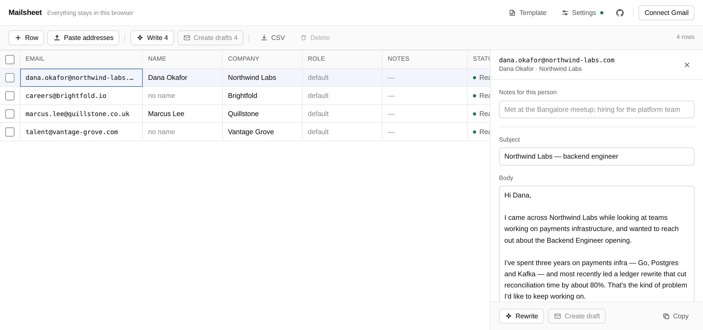

# Mailsheet

A spreadsheet for recruiter outreach. Paste a column of addresses, write one
template, let a model rewrite it for each recipient, then push every row into a
Gmail draft — and read each one before it goes out.

**Nothing is collected.** There is no database, no account, no analytics and no
cookie. Your API key, template, rows and Gmail token live in `localStorage` on
your own machine, and the model is called *directly from your browser*, so
neither the key nor the emails pass through the server that served the page.



## How it works

1. **Paste addresses.** Each becomes a row. The company is read off the domain
   (`careers.northwind-labs.com` → Northwind Labs) and the name off the local
   part (`dana.okafor@` → Dana Okafor). Shared mailboxes like `hr@`, `careers@`
   or `talent@` get no name at all. Every guess lands in an editable cell —
   correct it before you generate.
2. **Write your template once,** using `{{name}}`, `{{company}}`, `{{role}}`
   and `{{sender}}` wherever you want them.
3. **Generate.** The model gets your template plus what is known about the
   recipient, and is told to *rewrite* — same structure, same length, same
   voice — and never to invent facts about the company or the person. Where the
   name is only a guess it is told so, and greets neutrally rather than risking
   the wrong one. Where nothing is known, your template's fallbacks are used
   (`there`, `your team`).
4. **Review and draft.** Fix anything in the side panel, then create Gmail
   drafts. Drafts, never sends — the last look is always yours.

Without an API key the Write action still fills your template from the
placeholder values, so the app is usable offline; it just is not personalised.

**On rate limits**, a row waits and tries again rather than failing: up to
three retries, five minutes apart, with the remaining time shown in the Status
column. Only transient failures qualify — a 429, a timeout, or a 5xx from the
vendor. A rejected API key or a malformed request fails immediately, because no
amount of waiting fixes those. Stop abandons the wait at once.

## Quick start

```bash
git clone https://github.com/harshit960/Mailsheet.git
cd mailsheet
npm install
npm run dev          # http://localhost:3000
```

Then open Settings, paste a [Gemini API key](https://aistudio.google.com/apikey),
and you can generate straight away. Gmail drafting needs one more step, below.

Other scripts:

```bash
npm run build        # production build (also typechecks)
npm run start        # serve the production build
npm run lint
```

## Deploying

It is a stock Next.js app and deploys anywhere Next runs. On Vercel, import the
repo and accept the defaults — no environment variables are required, and there
are no server-side secrets to configure.

## Gmail drafting (optional)

Mailsheet talks to the Gmail API from the browser using Google's implicit OAuth
flow, so you need a Google OAuth **client ID**. In the
[Google Cloud Console](https://console.cloud.google.com/):

1. Enable the **Gmail API**.
2. *Credentials → Create credentials → OAuth client ID → Web application*.
3. Under **Authorised JavaScript origins**, add the origin you will use
   (`http://localhost:3000` for local dev, plus your deployed URL). No redirect
   URI is needed — the token never leaves the page.

Then either paste the client ID into Settings (stored in your browser only), or
set it for everyone on your deployment:

```bash
cp .env.example .env.local   # then fill in NEXT_PUBLIC_GOOGLE_CLIENT_ID
```

It is public by design — an OAuth client ID is not a secret.

Mailsheet requests **`gmail.compose` only**: enough to create drafts, not
enough to read your mail. It also asks for `userinfo.email` so it can show
which account is connected. The access token expires in about an hour, there is
no refresh token, and it is revoked when you disconnect.

## Privacy, precisely

| Thing | Where it lives | Who else sees it |
|---|---|---|
| API key | your browser's `localStorage` | the model vendor, on each request |
| Template, rows, generated emails | your browser's `localStorage` | the model vendor, on each request |
| Gmail access token | your browser's `localStorage` | Google |
| Anything at all | — | this app's own server: nothing |

There is one opt-in exception. If your browser cannot reach the model vendor
directly — some corporate networks block it — Settings offers a **relay** that
forwards the request through `/api/relay`. That route rebuilds the vendor URL
from the provider registry, so it cannot be pointed at any other host; it
forwards the request once, stores nothing and logs nothing. Direct is the
default, and the relay is used automatically only when a direct call is blocked
outright.

Clearing your browser's site data for Mailsheet erases everything it knows.
There is nothing to delete anywhere else.

## Adding a model provider

Gemini is the only provider so far, but nothing outside `src/lib/ai/` knows
that. A provider is a single object — `buildRequest`, `parseResponse`,
`parseError` — implementing the `Provider` interface in `src/lib/ai/types.ts`.
Add yours to `PROVIDERS` in `src/lib/ai/index.ts` and it shows up in Settings;
the relay's host allowlist is derived from the registry, so it picks the new
provider up on its own.

The prompt is built centrally in `src/lib/ai/prompt.ts` and shared across
vendors — put prompt changes there, not in a provider.
`src/lib/ai/gemini.ts` is about a hundred lines and is the reference
implementation.

## Project layout

```
src/
  app/            page, layout, and the optional relay route
  components/     grid, inspector, dialogs, toolbar
  lib/
    ai/           provider registry, prompt construction, Gemini
    derive.ts     company/name guesses from an address
    gmail.ts      implicit OAuth + draft creation
    mime.ts       RFC 5322 / 2047 message building
    store.ts      zustand, persisted to localStorage
    template.ts   placeholder rendering
```

Built with Next.js, React, Tailwind CSS, `react-data-grid` and zustand.

## Contributing

Issues and pull requests are welcome. Before opening a PR:

```bash
npm run lint
npm run build        # this typechecks too
```

Two things are worth knowing before you change behaviour:

- **Nothing may leave the browser by default.** If a change would route user
  content or an API key through this app's own server as the normal path, it is
  the wrong shape. `/api/relay` is the single deliberate, opt-in exception.
- **Guesses must stay visible.** `derive.ts` is heuristics, not truth. Anything
  it infers belongs in an editable cell, and low-confidence guesses are marked
  in the grid *and* flagged to the model so it can greet neutrally instead of
  using a name like "Jdoe". Please don't make them silent.

There is no test runner wired up yet. Behaviour has been checked by driving a
production build in a real browser with the model vendor and Google Identity
Services stubbed at the network layer; if you touch `mime.ts`, `derive.ts` or
the Gmail path, please verify round-trips by hand at minimum.

## License

[MIT](LICENSE).
